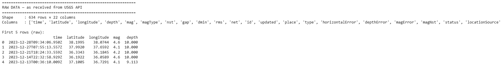
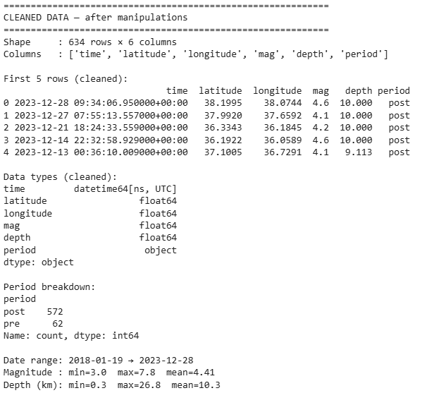
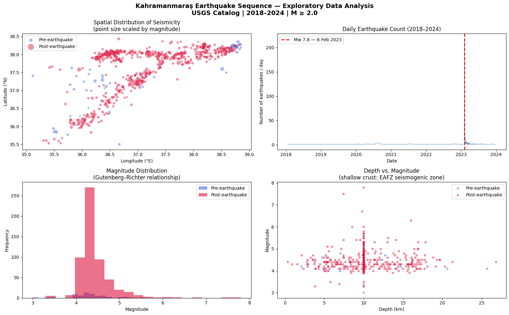
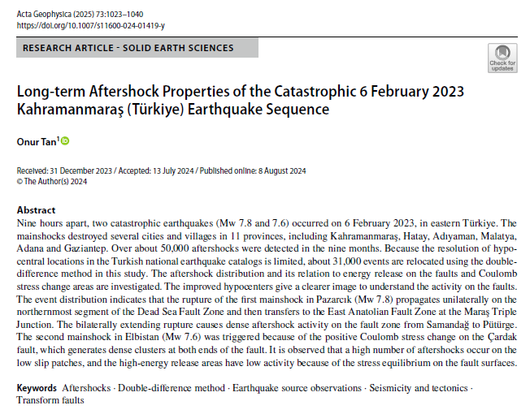
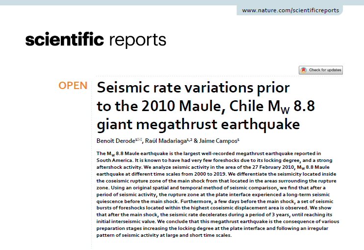
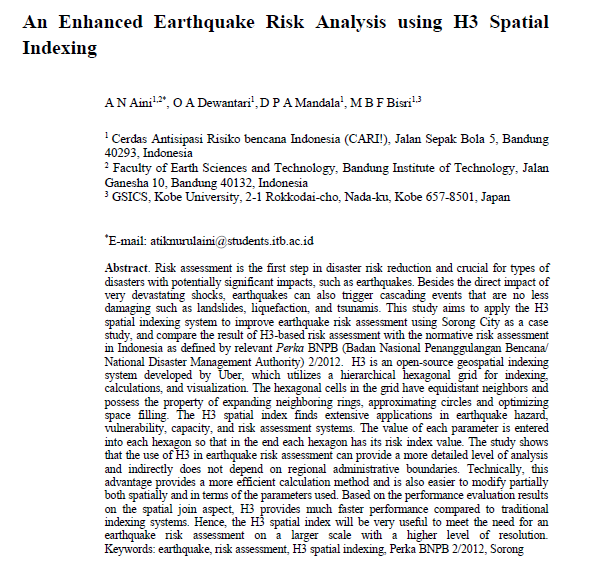
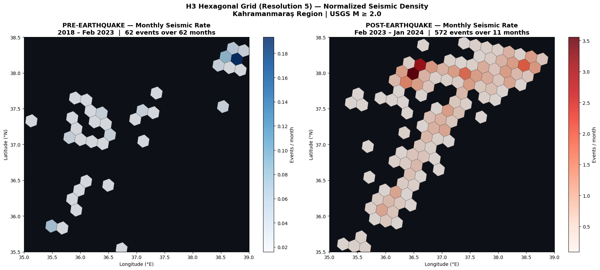
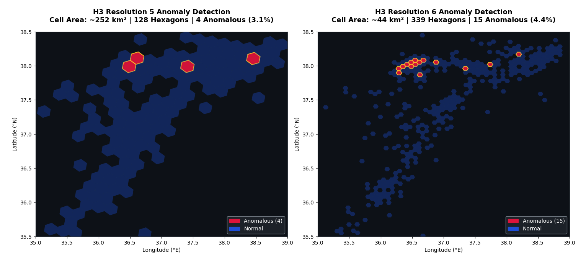
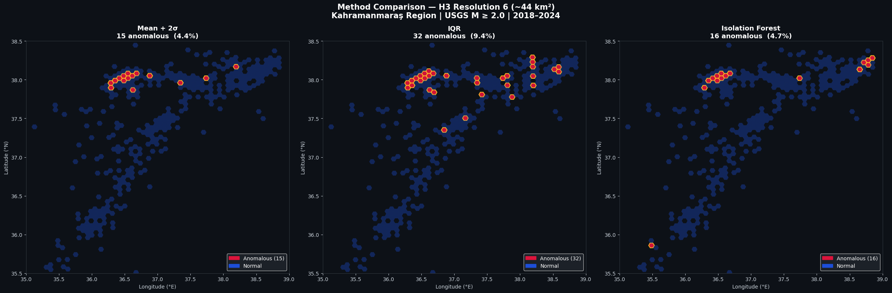
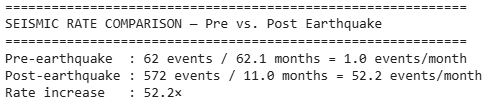

# Spatio-Temporal Analysis of Seismic Activity Around the 2023 Kahramanmaraş Earthquake

**Course:** Spatio-Temporal Data Mining  
**Dataset:** USGS Earthquake Catalog (2018–2024) | Kahramanmaraş Region, Türkiye  
**Tools:** Python · H3 · USGS FDSNWS API · Pandas · Matplotlib · Scikit-learn

---

## 1. Introduction & Motivation

On 6 February 2023, two catastrophic earthquakes struck eastern Türkiye nine hours apart: a Mw 7.8 mainshock near Pazarcık at 01:17 UTC, followed by a Mw 7.6 event near Elbistan at 10:24 UTC. The Pazarcık rupture initiated on the northernmost segment of the Dead Sea Fault Zone and propagated bilaterally along the East Anatolian Fault Zone (EAFZ) for approximately 300 km. The Elbistan mainshock ruptured the previously less-studied Çardak fault, triggered by the positive Coulomb stress change induced by the first event (Tan, 2025).

The disaster affected 11 provinces — including Kahramanmaraş, Hatay, Adıyaman, Malatya, Adana and Gaziantep — with more than 60,000 fatalities, approximately 15.73 million people affected, and roughly 345,000 apartments destroyed.

### 1.1 Scientific Motivation

Major earthquakes do not simply release stress — they fundamentally reorganize it. The 6 February 2023 sequence triggered one of the largest and most spatially extensive aftershock sequences recorded in modern Turkish seismological history, with over 50,000 aftershocks detected in the nine months following the mainshock (Tan, 2025). Identifying **where** and **how significantly** this spatial reorganization of seismicity occurred is both scientifically meaningful and directly relevant to ongoing seismic hazard assessment in the region.

This project addresses the following core research question:

> **Which spatial zones of the Kahramanmaraş region experienced statistically anomalous increases in seismic activity following the 6 February 2023 earthquake sequence, and does the detected pattern align with the known fault geometry of the East Anatolian Fault Zone?**

### 1.2 Why Spatio-Temporal Data Mining?

Each earthquake in a catalog is a **discrete event in four-dimensional space**: latitude, longitude, depth, and time. Detecting meaningful change in the distribution of these events across space and time — before and after a major rupture — is a classical **spatio-temporal data mining** problem.

Prior work has demonstrated that seismic rate variations are a powerful signal for understanding earthquake preparation and aftermath. Derode et al. (2021) showed that spatial and temporal decomposition of seismicity rates before and after the 2010 Mw 8.8 Maule earthquake in Chile can reveal long-term quiescence zones and post-seismic reorganization patterns invisible to non-spatial analysis.

This project applies analogous reasoning to the 2023 Kahramanmaraş sequence: by computing **normalized monthly seismic rates** per spatial unit before and after the mainshock, and flagging statistically anomalous rate changes, we aim to characterize the spatial footprint of the post-seismic stress redistribution.

## 2. Dataset Introduction
**Official data source:**
- USGS Earthquake Hazards Program: https://earthquake.usgs.gov
- FDSNWS Event API Documentation: https://earthquake.usgs.gov/fdsnws/event/1/
- ANSS Comprehensive Earthquake Catalog (ComCat): https://earthquake.usgs.gov/data/comcat/

> All data is publicly available and requires no authentication. Query results may vary slightly over time as the catalog is continuously updated with revised locations and magnitudes.

Seismicity data is sourced from the **USGS ANSS Comprehensive Earthquake Catalog (ComCat)**, accessed via the FDSNWS Event Web Service REST API — a freely accessible, programmatically queryable catalog that returns clean CSV output without authentication requirements.

| Parameter | Value |
|---|---|
| Provider | U.S. Geological Survey (USGS) |
| API Endpoint | `https://earthquake.usgs.gov/fdsnws/event/1/query` |
| Spatial Extent | 35.5°N–38.5°N, 35.0°E–39.0°E |
| Temporal Extent | 2018-01-01 — 2024-01-01 |
| Magnitude Threshold | M ≥ 2.0 |
| Format | CSV |

Each row in the catalog is a **point event in space-time**, carrying the following fields used in this analysis:

| Feature | Type | Dimension |
|---|---|---|
| `time` | datetime (UTC) | Temporal coordinate *t* |
| `latitude` | float (°N) | Spatial coordinate *y* |
| `longitude` | float (°E) | Spatial coordinate *x* |
| `depth` | float (km) | Spatial coordinate *z* |
| `mag` | float | Event attribute |

The mainshock date (6 February 2023) partitions the catalog into two analysis windows:

```
2018-01-01 ──────────────────────── 2023-02-06 ─────────── 2024-01-01
│              PRE-EARTHQUAKE                  │  POST-EARTHQUAKE  │
│               ~61 months                     │    ~11 months     │
```

Monthly seismic rates are computed separately per window and **normalized to events/month** to ensure fair comparison despite the unequal durations.

**Raw Dataset (USGS CSV output):**



**Processed Dataset (after cleaning & temporal partitioning):**
*634 events · 6 columns · pre/post labels assigned*



**Exploratory Data Analysis:**
*Monthly event count, magnitude distribution, and pre/post 
event comparison across the study period (2018–2024).*



---
## 3. Literature Review

### 3.1 Tan (2025) — Long-term Aftershock Properties of the 2023 Kahramanmaraş Sequence

> Tan, O. (2025). Long-term aftershock properties of the catastrophic 6 February 2023 Kahramanmaraş (Türkiye) earthquake sequence. *Acta Geophysica*, 73, 1023–1040. https://doi.org/10.1007/s11600-024-01419-y



This study provides the most comprehensive spatial characterization of the 2023 Kahramanmaraş earthquake sequence to date. Using the double-difference (hypoDD) relocation algorithm on ~50,000 events, Tan relocates approximately 30,939 aftershocks with improved precision, revealing the fault geometry of the East Anatolian Fault Zone (EAFZ) and Çardak fault in unprecedented detail.

Key findings directly relevant to this project:

- The Mw 7.8 Pazarcık rupture propagated bilaterally along the EAFZ for ~360 km, generating dense aftershock clusters along the Amanos, Pazarcık and Erkenek segments.
- Aftershock activity is highest in **low-slip patches** of the rupture surface — precisely the spatial zones where stress was not fully released and where our anomaly detection identifies elevated post-seismic rates.
- Modified Omori Law fitting reveals that the EAFZ aftershock sequence decays exponentially (p = 1.0), while the Elbistan sequence shows complex secondary clustering, indicating different stress release mechanisms on the two faults.

**Connection to this project:** Tan's relocated aftershock distribution provides independent ground truth for validating our H3-based anomaly map. The linear cluster of anomalous hexagons detected at Resolution 6 along ~38°N is spatially consistent with the dense aftershock zones reported along the Pazarcık and Erkenek segments of the EAFZ.

---

### 3.2 Derode et al. (2021) — Seismic Rate Variations Prior to the 2010 Maule Mw 8.8 Earthquake

> Derode, B., Madariaga, R., & Campos, J. (2021). Seismic rate variations prior to the 2010 Maule, Chile MW 8.8 giant megathrust earthquake. *Scientific Reports*, 11, 2705. https://doi.org/10.1038/s41598-021-82152-0



Derode et al. introduce a **spatial-temporal seismic rate comparison framework** in which the coseismic rupture zone (IN-zone) is compared against an area-equivalent surrounding zone (OUT-zone) across multiple time windows. By computing normalized cumulative seismic rates (events/year) per spatial zone, they detect a 2–3 year pre-seismic quiescence inside the future rupture area — an anomalous rate decrease not visible in the surrounding zone — followed by a short-lived foreshock burst days before the mainshock.

Key methodological contributions:

- Seismic rate normalization to events/month (or events/year) enables comparison across unequal observation windows — a technique adopted directly in this project.
- Statistical significance of rate changes is evaluated via Poisson probability analysis, providing a formal framework for distinguishing anomalous from background seismicity.
- Spatial decomposition of the catalog (IN vs OUT zone) demonstrates that rate changes are **localized** and fault-geometry-dependent, not region-wide.

**Connection to this project:** Our approach is methodologically analogous: we partition the catalog into pre- and post-earthquake windows, compute normalized monthly rates per H3 spatial unit, and flag statistically anomalous rate changes. While Derode et al. use pre-defined polygon zones, we employ the H3 hexagonal grid to achieve spatially continuous, boundary-independent anomaly detection at adjustable resolution.

---

### 3.3 Aini et al. (2023) — Enhanced Earthquake Risk Analysis using H3 Spatial Indexing

> Aini, A. N., Dewantari, O. A., Mandala, D. P. A., & Bisri, M. B. F. (2023). An enhanced earthquake risk analysis using H3 spatial indexing. *IOP Conference Series: Earth and Environmental Science*, 1245, 012014. https://doi.org/10.1088/1755-1315/1245/1/012014



Aini et al. present one of the first direct applications of the H3 Discrete Global Grid System (DGGS) to earthquake risk assessment, using Sorong City, Indonesia as a case study. The study compares H3-based risk maps against traditional administrative-boundary-based assessments (BNPB IRBI method), evaluating performance across statistical, visual, and SWOT dimensions.

Key findings relevant to DGGS methodology:

- H3-based assessment provides **finer spatial granularity** than administrative polygon methods, successfully identifying sub-district-level high-risk clusters invisible to the administrative approach.
- The **equidistant neighbor property** of hexagonal cells reduces spatial bias in proximity-based calculations — particularly relevant when computing rate changes between spatially adjacent cells.
- H3 performance in spatial join operations is significantly faster than traditional polygon-based indexing, making it scalable for large earthquake catalogs.
- Resolution selection is identified as a critical hyperparameter: too coarse a resolution masks local risk patterns, while too fine a resolution leads to sparse cells and unstable rate estimates.

**Connection to this project:** Aini et al. directly validate our choice of H3 as the spatial discretization framework. Their finding that resolution selection critically affects the detectability of localized spatial patterns is precisely demonstrated in our Resolution 5 vs Resolution 6 comparison, where the fault-aligned anomaly cluster emerges only at the finer resolution.

---

## 4. Discrete Global Grid System (DGGS) — H3 Spatial Indexing

### 4.1 What is H3?

H3 is an open-source hierarchical hexagonal spatial indexing system developed by Uber Technologies. It partitions the globe into a multi-resolution hierarchy of hexagonal cells, each identified by a unique 64-bit integer index. Unlike traditional raster grids or administrative boundaries, H3 offers three critical advantages for seismic point-process analysis (Aini et al., 2023):

- **Equidistant neighbors:** All six neighbors of a hexagon are equidistant from its centroid, eliminating the directional bias present in square grids where diagonal neighbors are farther than orthogonal ones.
- **Hierarchical resolution:** The grid supports 16 resolution levels (0–15), enabling analysis at any spatial scale without changing the underlying methodology.
- **Boundary independence:** Hexagonal cells do not follow administrative boundaries, making them well-suited for geophysical phenomena that are spatially continuous.

### 4.2 Assigning Earthquakes to H3 Cells

Each earthquake in the USGS catalog is assigned to an H3 cell at a given resolution using its latitude and longitude coordinates:

```python
import h3

df['h3_cell'] = df.apply(
    lambda r: h3.latlng_to_cell(r['latitude'], r['longitude'], resolution),
    axis=1
)
```

Events are then aggregated per cell, and monthly rates are computed for the pre- and post-earthquake windows independently. The **rate change** per cell is defined as:

```
rate_change = monthly_rate_post − monthly_rate_pre
```

This value forms the basis for all three anomaly detection methods.

**H3 Hexagonal Density Map:**


<p align="center"><sub>Figure 1 — H3 Density Maps</sub></p>

### 4.3 Resolution Comparison: Res 5 vs Res 6

A key design decision in any H3-based analysis is the choice of spatial resolution. To evaluate its effect, the Mean + 2σ anomaly detection pipeline was applied at two resolutions:

| Property | Resolution 5 | Resolution 6 |
|---|---|---|
| Approximate cell area | ~252 km² | ~44 km² |
| Total hexagons in study area | ~90 | ~341 |
| Anomalous hexagons (Mean+2σ) | 4 | 15 |
| Anomaly rate | ~4.4% | ~4.4% |


<p align="center"><sub>Figure 2 — H3 Resolution Comparison (Mean + 2σ baseline)</sub></p>

The results reveal a clear scale effect:

- **Resolution 5** detects only 4 isolated anomalous cells, distributed without apparent spatial coherence. At this granularity (~252 km² per cell), fault-scale structures are absorbed into single large hexagons, making it impossible to resolve the linear geometry of the East Anatolian Fault Zone.
- **Resolution 6** detects 15 anomalous cells forming a coherent linear cluster along approximately 38°N latitude — geometrically consistent with the known surface trace of the EAFZ between Pazarcık and Elbistan.

**Resolution 6 (~44 km²) was selected as the working resolution** for all subsequent analyses, as it provides sufficient granularity to resolve fault-scale spatial patterns while maintaining adequate event counts per cell for stable rate estimation.

---

## 5. Baseline Method — Anomaly Detection

### 5.1 Problem Formulation

For each H3 cell *h* at Resolution 6, the following quantity is computed:

```
Δr(h) = r_post(h) − r_pre(h)
```

where *r_pre* and *r_post* are the normalized monthly seismic rates (events/month) in the pre- and post-earthquake windows respectively. A cell is flagged as **anomalous** if its rate change Δr(h) exceeds a threshold defined by the chosen detection method.

Three baseline methods were evaluated:

### 5.2 Method 1 — Mean + 2σ (Primary Baseline)

The threshold is defined as:

```
threshold = μ(Δr) + 2 · σ(Δr)
```

where μ and σ are the mean and standard deviation of rate changes across all hexagons. Cells with Δr > threshold are flagged as anomalous. This method assumes that the bulk of cells represent background (normal) behavior, and treats extreme positive deviations as anomalies. It is the most interpretable and commonly used statistical baseline for seismic rate change detection (Derode et al., 2021).

**Result at Resolution 6:** 15 anomalous cells (4.4%)

### 5.3 Method 2 — IQR (Interquartile Range)

The threshold is defined using Tukey's fence:

```
threshold = Q3 + 1.5 · IQR,  where IQR = Q3 − Q1
```

IQR is robust to the influence of extreme values and does not assume a normal distribution. However, because earthquake rate data is heavily right-skewed — most hexagons have near-zero activity, while a small number show very high post-seismic rates — the upper fence Q3 + 1.5·IQR falls relatively low, causing IQR to flag a larger number of cells than the other methods.

**Result at Resolution 6:** 32 anomalous cells (9.4%) — notably more sensitive than Mean+2σ

### 5.4 Method 3 — Isolation Forest

Isolation Forest is an unsupervised machine learning algorithm that detects anomalies by measuring how easily a data point can be isolated from the rest of the dataset via random partitioning. Points that require fewer splits to isolate are considered anomalous. Unlike the threshold-based methods above, Isolation Forest models the global structure of the rate-change distribution rather than applying a fixed statistical rule.

```python
from sklearn.ensemble import IsolationForest

iso = IsolationForest(contamination=0.05, random_state=42)
anomaly_labels = iso.fit_predict(rate_change_values)
```

The `contamination=0.05` parameter instructs the model to treat approximately 5% of cells as anomalies, making the result directly comparable to the Mean+2σ output.

**Result at Resolution 6:** 16 anomalous cells (4.7%)

### 5.5 Method Comparison


<p align="center"><sub>Figure 3 — Baseline Method Comparison at Resolution 6</sub></p>

| Method | Anomalous Cells | Rate | Characteristic |
|---|---|---|---|
| Mean + 2σ | 15 | 4.4% | Interpretable, assumes rough normality |
| IQR | 32 | 9.4% | Robust but oversensitive on skewed data |
| Isolation Forest | 16 | 4.7% | ML-based, controlled by contamination parameter |

**Key finding:** Mean+2σ and Isolation Forest converge on a consistent set of ~15–16 anomalous cells, while IQR flags approximately twice as many due to the right-skewed nature of the rate-change distribution. The spatial core — a linear cluster of hexagons along the EAFZ trace near 38°N — is detected consistently by all three methods, reinforcing the robustness of the finding.

**Mean + 2σ is adopted as the primary baseline** for its interpretability and methodological alignment with the spatial seismic rate comparison framework introduced by Derode et al. (2021). IQR and Isolation Forest serve as sensitivity benchmarks.

---

## 6. Preliminary Results

### 6.1 Seismic Rate Change Distribution

After temporal partitioning at the mainshock date (6 February 2023) and spatial discretization at H3 Resolution 6, the rate-change distribution across 341 hexagons is strongly right-skewed: the overwhelming majority of cells show negligible rate change, while a small subset exhibits dramatic post-seismic increases. This distributional asymmetry is characteristic of fault-proximal aftershock sequences and motivates the use of upper-tail anomaly detection methods (Mean+2σ and IQR) rather than two-tailed tests.


<p align="center"><sub>Figure 4 — Normalized Monthly Rate Change</sub></p>

### 6.2 H3 Resolution Effect on Anomaly Detection

Applying the Mean + 2σ baseline at both Resolution 5 and Resolution 6 reveals a strong scale dependence in the detected anomaly pattern:

| Metric | Resolution 5 (~252 km²) | Resolution 6 (~44 km²) |
|---|---|---|
| Total hexagons | ~90 | 341 |
| Anomalous hexagons | 4 | 15 |
| Anomaly rate | ~4.4% | 4.4% |
| Spatial pattern | Isolated, incoherent | Linear, fault-aligned |
| EAFZ geometry visible | ❌ | ✅ |


<p align="center"><sub>Figure 5 — H3 Resolution Comparison (Mean + 2σ baseline)</sub></p>

At Resolution 5, the four anomalous cells are geographically scattered with no apparent structural alignment. At Resolution 6, the 15 anomalous cells form a coherent east-west linear cluster near 38°N latitude, consistent with the surface trace of the East Anatolian Fault Zone as mapped by Tan (2025) and the USGS finite fault models of the Pazarcık and Elbistan mainshocks.

### 6.3 Baseline Method Comparison at Resolution 6


<p align="center"><sub>Figure 6 — Baseline Method Comparison at Resolution 6</sub></p>

| Method | Anomalous Cells | Rate | Notes |
|---|---|---|---|
| Mean + 2σ | 15 | 4.4% | Consistent with fault geometry |
| IQR | 32 | 9.4% | Oversensitive due to right-skewed distribution |
| Isolation Forest | 16 | 4.7% | Constrained by contamination=0.05 |

All three methods agree on a **spatial consensus core** — a set of hexagons that are flagged as anomalous regardless of method. This consensus cluster is located along 38°N between approximately 36°E and 37.5°E longitude, coinciding with the highest-density aftershock zone of the Pazarcık rupture. The agreement across methodologically distinct approaches strengthens confidence in the finding.

IQR flags an additional ~17 cells beyond the consensus region. These secondary anomalies likely represent moderately elevated activity in hexagons located near fault step-overs and secondary structures — potentially real geophysical signal, but insufficiently extreme to cross the higher thresholds of Mean+2σ and Isolation Forest.

### 6.4 Key Finding

> The 6 February 2023 Kahramanmaraş earthquake sequence produced a spatially coherent, fault-aligned pattern of anomalously elevated seismic activity concentrated along the East Anatolian Fault Zone. This pattern is detectable with all three baseline methods at H3 Resolution 6 (~44 km²), but not at Resolution 5 (~252 km²), demonstrating that spatial resolution is a critical parameter in spatio-temporal seismic anomaly detection.

---

## 7. Limitations & Future Work

### 7.1 Current Limitations

- **Catalog completeness:** The USGS catalog threshold of M ≥ 2.0 may miss a significant portion of small aftershocks in the first weeks post-mainshock, when seismic station saturation and high coda noise suppress detection of smaller events. This could cause underestimation of post-seismic rates in the most active cells.
- **Depth dimension ignored:** Current analysis treats earthquakes as 2D point events (latitude, longitude only). The 3D structure of the EAFZ — including depth-dependent clustering — is not captured by the surface H3 grid.
- **Single temporal partition:** The analysis uses a single pre/post split at the mainshock date. A sliding-window temporal analysis would better characterize the time evolution of anomalous zones.
- **No magnitude weighting:** All M ≥ 2.0 events are treated equally regardless of magnitude. Weighting by seismic moment would assign greater significance to larger events.

### 7.2 Future Work

- Apply **temporal sliding windows** to track the decay of anomalous zones over time and compare with Modified Omori Law predictions (Tan, 2025).
- Incorporate **depth-stratified H3 analysis** using 3D hexagonal prisms to capture vertical fault structure.
- Test **additional resolution levels** (H3 Resolution 7, ~8 km²) to assess whether finer granularity further resolves sub-fault-segment anomaly patterns.
- Compare detected anomaly zones with **Coulomb stress change models** of the Pazarcık and Elbistan mainshocks to assess whether anomalous cells correspond to zones of positive stress loading.
